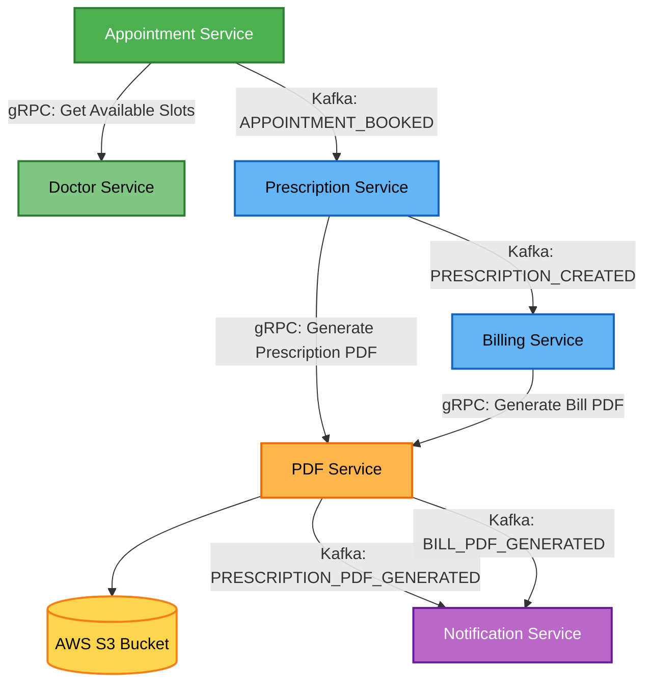

# Microservices Overview

A backend Hospital Management System that orchestrates the full patient workflow—from doctor appointment booking to prescription generation, billing, PDF document creation, and patient notifications using an event-driven microservices architecture.

Key backend design considerations include:
* Preventing double booking of appointment slots using Redis-based temporary locks
* Event-driven state propagation across services using Kafka
* Clear separation of domain responsibilities (appointments, prescriptions, billing, documents, notifications)
* Synchronous service communication via gRPC for real-time data (e.g., doctor slot availability)
* Asynchronous processing pipelines for prescription creation, billing, PDF generation, and notifications.
  
Core Technologies Used : Java 17, Spring Boot, Apache Kafka, gRPC, MongoDB, Postgres SQL, Redis, Docker, AWS S3, Maven

# Core Business Services

### Appointment Service

Handles the appointment booking workflow. This service contains the most critical booking logic and race-condition handling.

* Fetch available slots from Doctor Service (gRPC)
* Validate slot availability
* Persist confirmed appointments
* Publish APPOINTMENT_BOOKED Kafka event
* Prevent double booking using Redis temporary slot locks

### Prescription Service 

Responsible for creating medical prescriptions after appointments.

* Consume APPOINTMENT_BOOKED event
* Generate and store prescription records
* Request prescription PDF generation via PDF Service (gRPC)
* Publish PRESCRIPTION_CREATED Kafka event

### Billing Service

Manages bill creation for medical services.

* Consume PRESCRIPTION_CREATED event
* Generate billing records
* Calculate consultation charges
* Request bill PDF generation from PDF Service (gRPC)
* Represents the financial processing layer of the system.

# Supporting Infrastructure Services

### PDF Service

* Handles document generation and storage.
* Generate PDFs for prescriptions and bills
* Upload documents to AWS S3
* Publish kafka events (PRESCRIPTION_PDF_GENERATED, BILL_PDF_GENERATED) when documents are generated

### Notification Service

Responsible for patient notifications.

* Consume PDF generation events
* Send email and WhatsApp notifications which delivers links to generated documents
* Includes retry logic for failed notifications.

### Doctor Service

* Provides doctor availability and appointment slots.
* Store doctor schedules
* Dynamically generate appointment slots
* Expose slot availability via gRPC API
